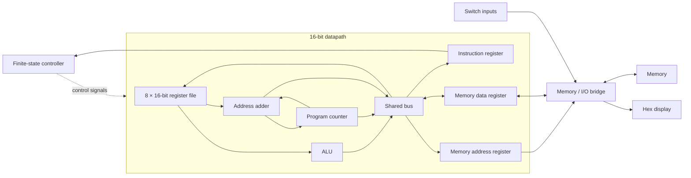

# 16-Bit Processor in SystemVerilog

A multicycle 16-bit processor with an eight-register datapath, arithmetic and logic operations, finite-state instruction control, and memory-mapped FPGA I/O.

The design connects a shared internal bus, ALU, register file, program counter, instruction register, and memory interface. Its controller sequences instruction fetch, decode, and execution, including memory wait states, conditional branches, subroutine calls, and interactive pause checkpoints.

## Architecture



- **Datapath:** 16-bit data and addresses, eight general-purpose registers, sign extension for immediate operands and offsets, and negative/zero/positive condition flags.
- **ALU:** addition, bitwise AND, bitwise NOT, and register pass-through.
- **Control:** 27 states covering fetch, decode, execution, memory access, and pause/resume sequencing.
- **Memory:** separate address and data registers, with explicit enable and write controls.
- **FPGA interface:** synchronized switches, debounced buttons, LEDs, and multiplexed seven-segment displays. The right display shows the instruction register.

## Instruction support

| Instruction | Operation |
| --- | --- |
| `ADD` | Register or signed immediate addition |
| `AND` | Register or signed immediate bitwise AND |
| `NOT` | Bitwise complement |
| `LDR` | Load using a base register plus signed offset |
| `STR` | Store using a base register plus signed offset |
| `BR` | PC-relative branch selected by condition flags |
| `JMP` / `RET` | Jump through a register; return through R7 |
| `JSR` | PC-relative subroutine call with return address in R7 |
| `PSE` | Display a 12-bit checkpoint on LEDs and wait for continue |

The controller implements the PC-relative call form. It does not implement a register-indirect subroutine call. Unrecognized opcodes return to instruction fetch.

## Memory and I/O

| Address | Behavior |
| --- | --- |
| `0xFFFF` read | Read the 16 switch inputs |
| `0xFFFF` write | Update the left hexadecimal display register |
| Other addresses | Access memory through the I/O bridge |

The CPU exposes a 16-bit address bus. The FPGA wrapper forwards its lower 10 bits to memory; the supplied simulation model contains 256 words and indexes the lower 8 bits. These configurations are not a full 64K-word memory system. Reset initializes the first 256 FPGA memory words; allow at least 256 clock cycles after reset before starting execution.

## Project layout

```text
rtl/            Processor, controller, I/O, memory wrapper, and program definitions
sim/            Fetch and I/O checks, system stimulus, and behavioral memory
constraints/    FPGA pin assignments and 100 MHz clock constraint
Makefile        Verilator simulation targets
```

Start with [`rtl/cpu.sv`](rtl/cpu.sv) for the datapath and [`rtl/control.sv`](rtl/control.sv) for instruction sequencing. [`rtl/processor_system.sv`](rtl/processor_system.sv) connects the CPU to I/O, and [`rtl/processor_top.sv`](rtl/processor_top.sv) adds synchronization and memory.

## Run the simulations

Requirements: Verilator with `--binary` and `--timing` support, a C++ compiler, and Make.

```sh
make test      # Self-checking fetch and memory-mapped I/O tests
make system    # Longer board-level bubble-sort stimulus
make clean     # Remove generated simulation files
```

| Testbench | Coverage |
| --- | --- |
| `tb_cpu_fetch.sv` | Checks PC-to-MAR transfer, PC increment, and MDR-to-IR transfer |
| `tb_program6_io.sv` | Checks boot selection, pause/resume, two switch reads, register values, display writes, and loop execution |
| `tb_processor_system.sv` | Drives the board wrapper through the bubble-sort menu; stimulus only, without a sorting-result assertion |

Validated with Verilator 5.052: both self-checking tests pass, and the board-level stimulus completes. FPGA synthesis and hardware execution were not rerun for this packaging update.

The fetch and I/O tests drive and sample signals on falling clock edges to avoid races with rising-edge register updates. Simulation products stay under `build/`. Existing width and timescale warnings are nonfatal; warnings should be reviewed before extending the design.

## Example programs

Instruction-encoding helpers and the initial memory image live in [`rtl/types.sv`](rtl/types.sv). The boot sequence clears R0, reads the switches into R1, and jumps to the selected start address.

| Start address (decimal) | Program |
| --- | --- |
| 3 | Continuous switch-to-display loop |
| 6 | Switch-to-display loop with pause checkpoints |
| 11 | Self-modifying checkpoint demonstration |
| 20 | XOR composed from AND and NOT |
| 42 | Subroutine return / jump demonstration |
| 49 | Multiplication routine |
| 90 | Interactive bubble sort |
| 156 | Automatic counter |

For the pause-based I/O example, select `6` on the switches, pulse run, then change the switch value and press/release continue at each checkpoint.

## FPGA setup

1. Add the files in `rtl/` as SystemVerilog design sources and set `processor_top` as the synthesis top. Make `rtl/` an include directory; `types.sv` is included by the memory initialization module.
2. Add `constraints/top.xdc` only for the matching Urbana board pinout. Adapt pin assignments and I/O standards for another board.
3. Create a single-port Block Memory Generator instance named `blk_mem_gen_0`, with 16-bit data, 1,024 words, enable and write-enable ports, and a registered read output. The controller provides three memory-access states to accommodate the synchronous memory path.
4. Run synthesis and implementation, generate a bitstream, and program the board. Reset, wait for memory initialization, select a program, and pulse run.

The generated memory IP, Vivado project, and bitstream are not included. The simulation checks do not establish timing closure or replace verification on hardware.

## Source credits

The processor implementation is packaged with supporting memory, display, synchronization, and program utilities adapted from UIUC ECE Department materials. Existing author and revision credits are retained in the source files.
